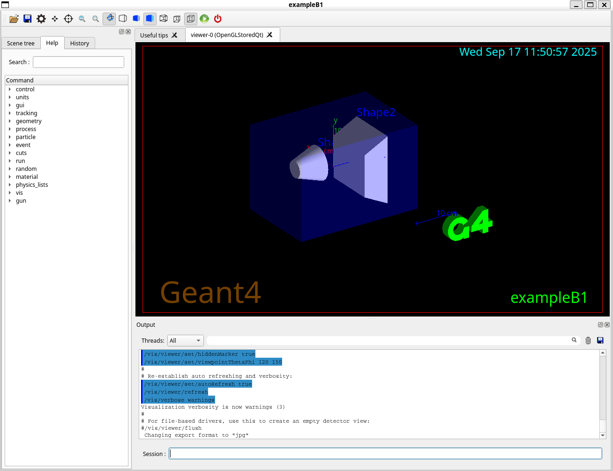

# Proyecto-Rayos-Cosmicos

## Uso de Geant4

Instalación mediante anaconda en Ubuntu/WSL. Ejecutamos en la terminal:
- `conda create -c conda-forge --name geant4 geant4`
- `conda activate geant4`

Revisar la instalación:
- `geant4-config --version`

Creamos una carpeta de trabajo e ingresamos a ella:
- `mkdir Geant4`
- `cd Geant4`

Clonamos el repositorio para poder acceder a los ejemplos:
- `git clone https://github.com/Geant4/geant4` (se puede omitir la instalación con anaconda y compilar from source, pero mantenemos lo primero por simplicidad. Tendremos las cosas por duplicado, pero para una primera aproximación a Geant4, me parece adecuado.)

Probablemente falten los siguientes paquetes:
- `conda install -c conda-forge expat`
- `conda install -c conda-forge compilers`

En una instalación nueva de WSL/Ubuntu, es necesario instalar las herramientas de compilación básicas.

- `sudo apt update`
- `sudo apt install cmake build-essential -y`

Ingresamos a la carpeta de ejemplos:
- `cd geant4/examples/basic/B1`

Creamos una carpeta para la compilación y accedemos a ella:
- `mkdir build & cd build`

Compilamos:
- `cmake .. -DGeant4_DIR=$CONDA_PREFIX/lib/Geant4-11.3.2 -DCMAKE_PREFIX_PATH=$CONDA_PREFIX`
- `make -j4`

Ejecutamos:
- `./exampleB1`

Deberíamos poder ver lo siguiente:
- 

